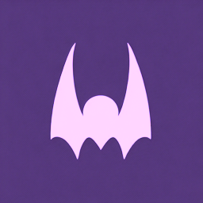
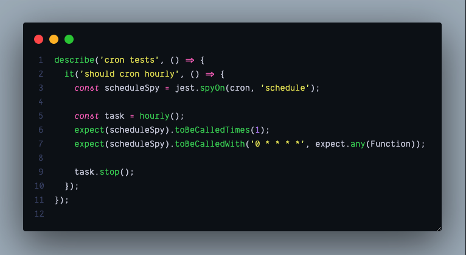
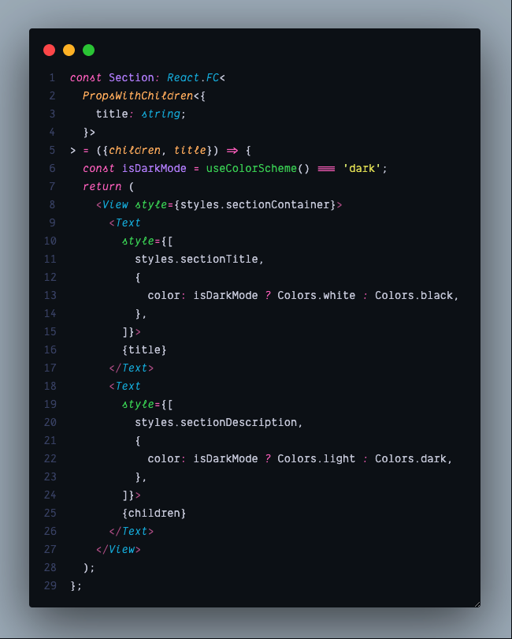
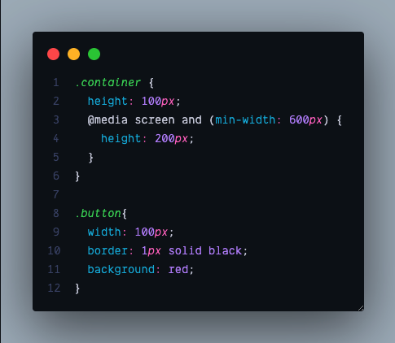

<div align="center">



# Draculinho

A darker, moodier take on the classic [Dracula](https://draculatheme.com) theme. Crafted for ligature fonts and italic lovers.

[](https://marketplace.visualstudio.com/items?itemName=eduardoborges.draculinho)
[](https://open-vsx.org/extension/eduardoborges/draculinho)
[](./LICENSE.md)

</div>

---

## Preview

**JavaScript**



**React / TSX**



**CSS**



## Color Palette

| Color          | Hex       | Preview |
|----------------|-----------|---------|
| Background     | `#0E131B` |  |
| Foreground     | `#CDD0DD` |  |
| Purple         | `#BD93F9` |  |
| Pink           | `#FF79C6` |  |
| Cyan           | `#00B5DC` |  |
| Green          | `#3dcf62` |  |
| Orange         | `#FFB86C` |  |
| Red            | `#FF5555` |  |
| Yellow         | `#E2DD61` |  |
| Comment        | `#465276` |  |

## Install

| Editor   | Link |
|----------|------|
| VS Code  | [`ext install eduardoborges.draculinho`](https://marketplace.visualstudio.com/items?itemName=eduardoborges.draculinho) |
| Cursor   | [`ext install eduardoborges.draculinho`](https://open-vsx.org/extension/eduardoborges/draculinho) |
| VSCodium | [`ext install eduardoborges.draculinho`](https://open-vsx.org/extension/eduardoborges/draculinho) |

Or search for **Draculinho** in your editor's extension panel.

## Recommended Setup

This theme was designed with ligature and italic fonts in mind. For the best experience, try one of these fonts:

- [Dank Mono](https://philpl.gumroad.com/l/dank-mono) — ligatures and beautiful italics, made for code
- [JetBrains Mono](https://www.jetbrains.com/lp/mono/)
- [Fira Code](https://github.com/tonsky/FiraCode)
- [Cascadia Code](https://github.com/microsoft/cascadia-code)

Then enable ligatures and italic rendering in your `settings.json`:

```json
{
  "editor.fontLigatures": true,
  "editor.tokenColorCustomizations": {
    "[Draculinho]": {
      "textMateRules": [
        {
          "scope": "comment",
          "settings": { "fontStyle": "italic" }
        }
      ]
    }
  }
}
```

## What Makes It Different

Draculinho keeps the Dracula DNA but pushes the background **much darker** (`#0E131B` vs the original `#282A36`), giving a deeper, more focused feel — especially on OLED displays. Keywords, storage types, and special variables render in *italic*, making the code structure stand out at a glance.

## License

[MIT](./LICENSE.md) — based on the original [Dracula Theme](https://github.com/dracula/dracula-theme) by Zeno Rocha.
