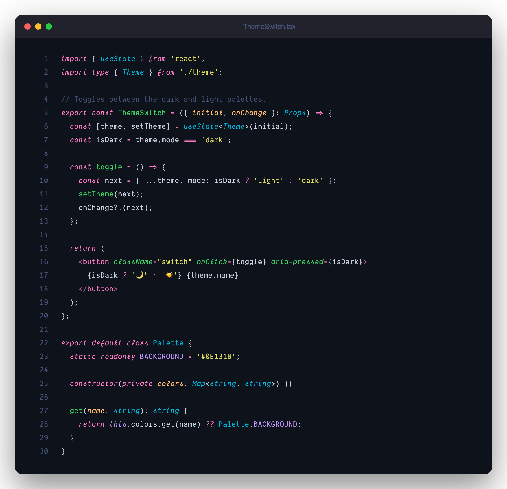
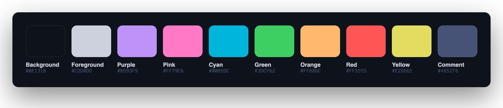
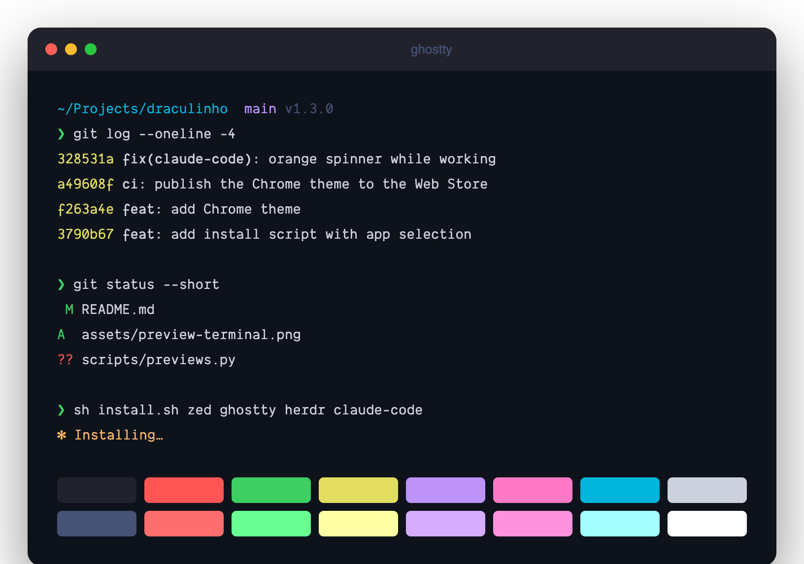
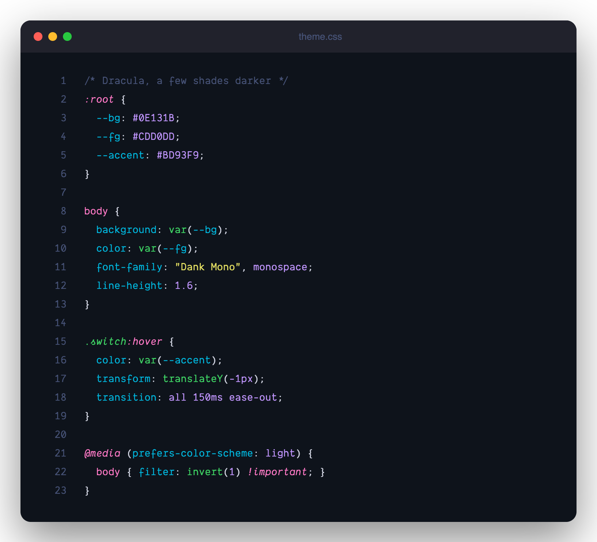

<div align="center">


# Draculinho

Dracula, a few shades darker. Made for ligature fonts and italics.

[](https://marketplace.visualstudio.com/items?itemName=eduardoborges.draculinho)
[](https://open-vsx.org/extension/eduardoborges/draculinho)
[](./LICENSE.md)

<br />



</div>

## One palette, six apps

| App | Install |
|---|---|
| VS Code, Cursor, VSCodium | Search for **Draculinho** in the extensions panel, or [`ext install eduardoborges.draculinho`](https://marketplace.visualstudio.com/items?itemName=eduardoborges.draculinho) |
| Zed | `sh install.sh zed` |
| Ghostty | `sh install.sh ghostty` |
| Herdr | `sh install.sh herdr` |
| Claude Code | `sh install.sh claude-code` |
| Chrome | `sh install.sh chrome`, then load it unpacked |

The script copies each theme into place and points the app's config at it. Run it with no arguments for a menu, name the apps you want, or pass `all`:

```sh
curl -fsSL https://raw.githubusercontent.com/eduardoborges/draculinho/main/install.sh | sh
```

<details>
<summary>Manual steps, per app</summary>

**Zed.** Copy [`themes/zed/draculinho.json`](./themes/zed/draculinho.json) to `~/.config/zed/themes/` and set `"theme": { "mode": "dark", "dark": "Draculinho" }` in your settings.

**Ghostty.** Copy [`themes/ghostty/draculinho`](./themes/ghostty/draculinho) to `~/.config/ghostty/themes/`, add `theme = draculinho` to your config and reload (cmd+shift+, on macOS).

**Herdr.** Herdr has no theme files, only overrides on top of a built-in theme. Paste the contents of [`themes/herdr/draculinho.toml`](./themes/herdr/draculinho.toml) into `~/.config/herdr/config.toml` and run `herdr server reload-config`.

**Claude Code.** Copy [`themes/claude-code/draculinho.json`](./themes/claude-code/draculinho.json) to `~/.claude/themes/` and pick Draculinho in `/theme`, or set `"theme": "custom:draculinho"` in `~/.claude/settings.json`.

**Chrome.** Chrome only takes themes from the Web Store or as an unpacked extension. Open `chrome://extensions`, turn on Developer mode, click Load unpacked and pick the [`themes/chrome`](./themes/chrome) folder.

</details>

## Palette



Draculinho keeps Dracula's hues and drops the background from `#282A36` to `#0E131B`. Green, cyan and yellow are pulled back a notch so they don't glow against the darker ground, and comments sit at `#465276`, dim enough to read past. Keywords, storage types and `this` are italic, which is where a font with a real italic earns its place.

## Terminal

<div align="center">

</div>

Ghostty and Zed's terminal share the same sixteen ANSI colors. Herdr gets `[theme.custom]` overrides on its built-in Dracula. Claude Code gets the palette across the prompt, diffs and status colors, with the working spinner in orange.

## CSS

<div align="center">

</div>

## Fonts

The previews use [Dank Mono](https://philpl.gumroad.com/l/dank-mono). [JetBrains Mono](https://www.jetbrains.com/lp/mono/), [Fira Code](https://github.com/tonsky/FiraCode) and [Cascadia Code](https://github.com/microsoft/cascadia-code) also have proper italics. In VS Code, turn ligatures on and, if you like, italic comments too:

```json
{
  "editor.fontLigatures": true,
  "editor.tokenColorCustomizations": {
    "[Draculinho]": {
      "textMateRules": [{ "scope": "comment", "settings": { "fontStyle": "italic" } }]
    }
  }
}
```

## Development

Each port lives in `themes/<app>/`. The VS Code theme is the reference and the others follow its colors. `python3 scripts/previews.py` regenerates the images in `assets/` with headless Chrome.

Releases come from conventional commits on `main`. `feat:` bumps the minor version, `fix:` the patch. CI then publishes to the VS Code Marketplace and Open VSX. The Chrome Web Store job runs once its credentials are set.

## License

[MIT](./LICENSE.md). Based on the [Dracula Theme](https://github.com/dracula/dracula-theme) by Zeno Rocha.
